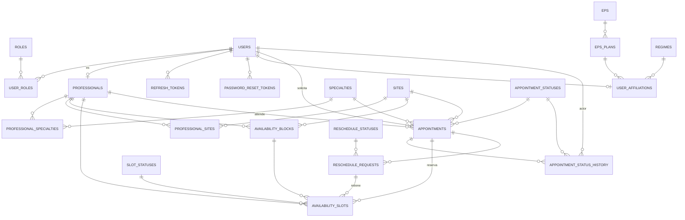

# Modelo relacional 3FN — citas-api

Diseño propio, elaborado a partir de `database/REQUISITOS_NORMALIZACION_3FN.md` y `PRD.md`, **sin consultar** `database/reference/db.sql` (la comparación posterior está en `COMPARACION_REFERENCIA.md`). Implementado en `src/main/resources/db/migration/V1__esquema_inicial.sql` (estructura) y `V2__seed_catalogos_fijos.sql` (datos fijos, RF-05).

## 1. Diagrama ER

## 2. Catálogos (RF-05 fijos, RF-06 configurables)

| Tabla | Tipo | Contenido |
|---|---|---|
| `roles` | Fijo | `USER`, `PROFESSIONAL`, `ADMIN` |
| `sites` | Fijo | HIC, ICV (dirección pública real, ver PRD sección 3) |
| `regimes` | Fijo | régimen de afiliación (p. ej. `CONTRIBUTIVO`, `SUBSIDIADO`) |
| `appointment_statuses` | Fijo | `REQUESTED`, `APPROVED`, `REJECTED`, `CANCELLED`, `COMPLETED`, `NO_SHOW` |
| `reschedule_statuses` | Fijo | `PENDING`, `APPROVED`, `REJECTED` |
| `slot_statuses` | Fijo | `FREE`, `HELD`, `BOOKED` (interno, no es un RF explícito pero sostiene RN-01) |
| `eps` | Configurable | ABC EPS, ... |
| `eps_plans` | Configurable | plan de una EPS |
| `specialties` | Configurable | nombre + `duration_minutes` (30/60, RF-09) + `is_general` |

Ningún catálogo permite borrado físico si está referenciado; todos tienen `active`/equivalente para desactivar (RF-06).

## 3. Núcleo de usuarios

- **`users`**: una única tabla para USER/PROFESSIONAL/ADMIN (RF-01). `id CHAR(36)` (UUID) porque el dominio (`Usuario.registrarNuevo`) ya genera el id en memoria antes de persistir — evita un viaje extra a la base solo para obtener un autoincremental.
- **`user_roles`** (N:M): un usuario puede tener más de un rol simultáneo (aunque el PRD no lo ejercita hoy, el catálogo de roles es N:M "usuarios y múltiples roles" según el enunciado de la actividad).
- **`professionals`**: extensión 1:1 de `users` (PK = FK = `user_id`). Un profesional **es** un usuario especializado, no una entidad separada (RF-07).
- **`refresh_tokens`**: una fila por refresh token vigente/revocado; `id` = `jti` del JWT.
- **`password_reset_tokens`**: soporta RF-03; `token_hash` (no el token plano) para no guardar secretos reutilizables en claro.

## 4. Profesionales, especialidades y sedes

- **`professional_specialties`** (N:M) con `is_primary`. Restricción: **una sola especialidad primaria por profesional**. MySQL no permite `UNIQUE` condicional directo, así que se usa una columna generada `primary_flag` (`professional_id` si `is_primary=1`, si no `NULL`) con `UNIQUE KEY` sobre ella — los `NULL` no chocan entre sí en MySQL, así que solo se impide tener dos filas `is_primary=1` para el mismo profesional.
- **`professional_sites`** (N:M): sedes habilitadas (RN-07).

## 5. Disponibilidad y slots (RF-08, RF-09, RF-10, RN-01, RN-05)

- **`availability_blocks`**: el bloque que crea el profesional (p. ej. 08:00–12:00 HIC).
- **`availability_slots`**: cada bloque se **materializa** en filas de 30 minutos al crearlo. Esto es lo que permite reservar/retener un slot con una simple actualización de fila (y bloqueo optimista/`SELECT ... FOR UPDATE`) en vez de recalcular solapamientos en cada reserva.
  - `professional_id` está **denormalizado** aquí (es derivable de `block_id → availability_blocks.professional_id`, así que en sentido estricto depende transitivamente de una columna no clave). Es una desnormalización deliberada: permite el índice único `(professional_id, start_at)` que impide solapar slots del mismo profesional **entre bloques distintos**, algo que no se puede expresar como restricción SQL si `professional_id` no está en la misma fila. Ver `COMPARACION_REFERENCIA.md` para contrastar con la solución del trainer.
  - `status_id` (FREE/HELD/BOOKED) + `appointment_id`/`reschedule_request_id` (mutuamente excluyentes, ver `CHECK` en el DDL) es el mecanismo anti doble-reserva (RN-01): reservar/solicitar = `UPDATE ... WHERE status_id = FREE`, que falla limpiamente si alguien más ya lo tomó.
  - RF-09 (60 min = 2 slots consecutivos): se logra reservando 2 filas de `availability_slots` consecutivas para la misma cita.

## 6. EPS / afiliación (RF-04)

- **`user_affiliations`**: `PRIMARY KEY (user_id)` — un usuario tiene **como máximo una fila**, es decir, una sola afiliación (EPS+plan+régimen) a la vez. "Evitar duplicar EPS/régimen/plan dentro del usuario" se resuelve por diseño, no por validación de aplicación: cambiar de afiliación es un `UPDATE`, no un `INSERT` adicional.
- `eps_plans.eps_id` ata cada plan a una única EPS (evita que un plan quede huérfano o ambiguo).

## 7. Citas y auditoría (RF-11 a RF-19)

- **`appointments`**: `user_id`, `professional_id`, `specialty_id`, `site_id` son FK (no snapshot) porque el PRD no pide conservar el nombre histórico si el catálogo cambia; `start_at`/`end_at` sí se guardan como snapshot en la cita (aunque son derivables de los slots reservados) porque RF-13 exige mostrarlos sin tener que reconstruirlos desde `availability_slots` en cada consulta de "mis citas".
- **Cita general vs. especializada**: no hay catálogo de "tipo de cita" separado. `specialties.is_general = TRUE` marca Medicina General (RF-11); así se evita repetir el mismo dato de dos formas (RF-06 principio de 3FN: no dependencias redundantes).
- **`appointment_status_history`**: RF-19. Nunca se actualiza ni se borra desde la aplicación (RN-12); solo se inserta.
- **`reschedule_requests`**: referencia la cita original (`appointment_id`) y guarda la nueva franja propuesta. Mientras está `PENDING`, la cita original **no se toca** (RN-10): la nueva franja se retiene marcando los `availability_slots` correspondientes con `reschedule_request_id`, nunca reescribiendo `appointments`.

## 8. Normalización — justificación 1FN → 2FN → 3FN

**1FN**: todos los atributos son atómicos. No hay columnas tipo `especialidades='1,2,3'`; toda relación N:M (`user_roles`, `professional_specialties`, `professional_sites`) usa tabla puente.

**2FN**: las únicas tablas con clave compuesta son las tablas puente N:M (`user_roles`, `professional_specialties`, `professional_sites`); no tienen ningún atributo no clave que dependa solo de una parte de la clave (a lo sumo `is_primary`, que depende de `(professional_id, specialty_id)` completo, no de una sola columna).

**3FN**: ningún atributo no clave depende transitivamente de otro atributo no clave:
- No se repite `eps.name`/`regimes.name`/`eps_plans.name` dentro de `users` ni `user_affiliations` (se referencian por FK).
- No se repite `specialties.name` dentro de `professionals` ni `appointments` (FK a `specialties`).
- Los estados (`appointment_statuses`, `reschedule_statuses`, `slot_statuses`) son catálogos propios, nunca cadenas de texto libres divergentes.
- **Excepción documentada**: `availability_slots.professional_id` (ver sección 5) es una dependencia transitiva deliberada por restricción de unicidad entre bloques; es la única desviación consciente de 3FN estricta en todo el modelo.

## 9. Respuestas a las decisiones exigidas por la actividad

1. **Claves primarias/únicas**: `users.id` UUID (generado en dominio); resto de catálogos y tablas transaccionales usan `BIGINT AUTO_INCREMENT`. Únicas: `users.email`, `users.document_number`, `professionals.professional_code`, `professionals.license_number`, `specialties.name`, `(professional_id, start_at)` en slots.
2. **Cardinalidades**: usuario 1:1 profesional (opcional); profesional N:M especialidad y N:M sede; usuario 1:1 (0..1) afiliación; cita 1:N historial de estados; cita 1:N slots reservados (1 si dura 30 min, 2 si dura 60); cita 0:N solicitudes de reprogramación (normalmente 0 o 1 pendiente a la vez, no forzado por FK sino por regla de aplicación).
3. **Catálogos fijos vs. configurables**: ver tabla de la sección 2.
4. **Doble reserva**: `availability_slots.status_id` + `UPDATE ... WHERE status_id = FREE` (ver sección 5); probado en `HU-014`/`HU-015` (S3).
5. **Citas de 60 minutos**: 2 filas consecutivas en `availability_slots` ligadas a la misma `appointment_id`.
6. **No perder la cita original en una reprogramación pendiente**: `reschedule_requests` es una tabla aparte; `appointments` no se modifica hasta que la reprogramación se aprueba (RN-10).
7. **Auditoría de estados**: `appointment_status_history`, solo `INSERT`, nunca `UPDATE`/`DELETE` desde la aplicación (RN-12).
8. **Snapshot vs. FK**: ver sección 7 (`start_at`/`end_at` como snapshot; el resto por FK).
9. **Índices para agenda**: `(professional_id, start_at)` único en `availability_slots` (ya cubre las consultas de agenda por profesional/fecha); índice en `appointments(professional_id, status_id, start_at)` para RF-16; índice en `appointments(user_id, status_id)` para RF-13.

## 10. Alcance de la migración inicial

`V1__esquema_inicial.sql` crea **todas** las tablas de este documento de una vez (es una actividad de diseño integral, no incremental), porque el modelo relacional se beneficia de diseñarse como un todo. La **implementación de casos de uso/JPA** sobre las tablas más allá de autenticación (usuarios/roles/tokens) queda para cuando las HU correspondientes (EP-002 en adelante) se aprueben en S3/S4, siguiendo el backlog de `docs/wiki/scrum/`.
