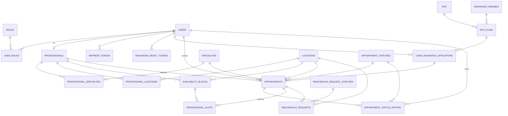

# Modelo relacional 3FN — citas-api

> **2026-09-23 — Reemplazado por decisión explícita del usuario.** El modelo original de este documento era un diseño propio del agente, elaborado sin consultar `database/reference/db.sql` (ver `COMPARACION_REFERENCIA.md` para la comparación que se hizo en su momento y el razonamiento de cada diferencia). El usuario pidió que el esquema quedara **exacto** a la referencia del trainer, incluyendo las partes donde el diseño propio ya se había implementado y probado (usuarios, refresh tokens). Este documento describe el esquema **adoptado** (copia estructural de `db.sql`), no un diseño independiente. La comparación original se conserva en `COMPARACION_REFERENCIA.md` como registro histórico de la decisión.

Implementado en `src/main/resources/db/migration/V1__esquema_inicial.sql` (estructura, copia de `db.sql`) y `V2__seed_catalogos_fijos.sql` (datos de catálogo fijos/públicos — RF-05 y parte de RF-06 — ver alcance del seed más abajo).

## 1. Diagrama ER

## 2. Catálogos (RF-05 fijos, RF-06 configurables)

| Tabla | Tipo | Contenido |
|---|---|---|
| `roles` | Fijo | `USER`, `PROFESSIONAL`, `ADMIN` |
| `locations` | Fijo | HIC, ICV (dirección pública real, ver PRD sección 3) |
| `insurance_regimes` | Fijo | régimen de afiliación (`CONTRIBUTIVO`, `SUBSIDIADO`, `ESPECIAL`, `EXCEPCION`, `PARTICULAR`) |
| `appointment_statuses` | Fijo | `REQUESTED`, `APPROVED`, `REJECTED`, `CANCELLED`, `COMPLETED`, `NO_SHOW` (con `is_terminal`) |
| `reschedule_request_statuses` | Fijo | `PENDING`, `APPROVED`, `REJECTED`, `CANCELLED` (con `is_terminal`) |
| `eps` | Configurable | catálogo de EPS (RF-06) |
| `eps_plans` | Configurable | plan de una EPS + régimen |
| `specialties` | Configurable | nombre + `appointment_duration_minutes` (30/60, RF-09) + `is_general` + `requires_admin_approval` |

Ningún catálogo permite borrado físico si está referenciado (FK `ON DELETE RESTRICT`); los operacionales tienen `active` para desactivar (RF-06).

**Alcance del seed en `V2`**: solo se cargan las filas de `roles`, `insurance_regimes`, `appointment_statuses`, `reschedule_request_statuses`, `locations` y `specialties` (secciones 5-6 de `db.sql`). **No** se cargan los datos sintéticos de operación de `db.sql` sección 7 (profesionales demo, pacientes demo, disponibilidad, citas y reprogramaciones de ejemplo): esas tablas no tienen todavía ningún caso de uso/adaptador JPA implementado, y no hay HU aprobada (EP-002 en adelante siguen en Borrador) que los necesite. Si se quieren esos datos de ejemplo más adelante, agregar una migración `V3` cuando se implemente el CRUD correspondiente.

## 3. Núcleo de usuarios

- **`users`**: una única tabla para USER/PROFESSIONAL/ADMIN (RF-01). `id BIGINT UNSIGNED AUTO_INCREMENT` — lo asigna MySQL al insertar. El dominio (`Usuario.registrarNuevo`) construye el agregado con `id = null`; `UsuarioRepositoryPort.guardar` siempre devuelve el `Usuario` con el id ya poblado tras persistir (ver `UsuarioJpaAdapter`).
- **`user_roles`** (N:M): un usuario puede tener más de un rol simultáneo.
- **`professionals`**: **ya no** reutiliza `user_id` como PK (a diferencia del diseño anterior). Tiene su propio `id BIGINT UNSIGNED AUTO_INCREMENT` + `user_id BIGINT UNSIGNED UNIQUE` (relación 1:1 con `users`, pero con espacio de identidad propio). Sin caso de uso/adaptador JPA implementado todavía (EP-004, sin aprobar).
- **`refresh_tokens`**: `id BIGINT UNSIGNED AUTO_INCREMENT` (surrogate, no se usa para buscar); cada fila se identifica por `token_hash` — el SHA-256 hexadecimal del `jti` del JWT (no el `jti` en claro), calculado en `RefreshTokenJpaAdapter`. Esto protege el identificador de sesión aunque la tabla se filtre. Incluye `device_info` (no usado todavía por la aplicación).
- **`password_reset_tokens`**: soporta RF-03 (sin implementar, HU-003 en Borrador); `token_hash`, no el token en claro.

## 4. Profesionales, especialidades y sedes

Sin caso de uso/adaptador JPA implementado (EP-004/EP-005, sin aprobar). Estructura copiada de `db.sql`:

- **`professional_specialties`** (N:M) con `is_primary`, sin restricción de unicidad de "una sola primaria por profesional" a nivel de base de datos (a diferencia del diseño anterior, que sí la forzaba con una columna generada). Si se necesita esa garantía, quedaría como validación de aplicación al implementar EP-004.
- **`professional_locations`** (N:M): sedes habilitadas (RN-07).

## 5. Disponibilidad y slots (RF-08, RF-09, RF-10, RN-01, RN-05)

Sin caso de uso/adaptador JPA implementado (EP-005, sin aprobar).

- **`availability_blocks`**: el bloque que crea el profesional (p. ej. 08:00–12:00 HIC).
- **`professional_slots`**: cada bloque se materializa en filas de 30 minutos. El mecanismo anti doble-reserva (RN-01) es más simple que en el diseño anterior: `appointment_id` nullable — reservar = `UPDATE ... WHERE appointment_id IS NULL`. **No existe** un catálogo de estados de slot (`FREE`/`HELD`/`BOOKED`) ni una columna para retener el slot durante una reprogramación pendiente; eso queda como diferencia consciente frente al diseño anterior (ver nota en la sección 7).
  - RF-09 (60 min = 2 slots consecutivos): se logra reservando 2 filas consecutivas de `professional_slots` para la misma cita.

## 6. EPS / afiliación (RF-04)

- **`user_insurance_affiliations`**: a diferencia del diseño anterior (una sola fila por usuario), esta tabla permite **historial**: varias filas por usuario, con `is_current`/`valid_from`/`valid_to`. `appointments.insurance_affiliation_id` puede referenciar la afiliación vigente al momento de cada cita. Sin caso de uso implementado todavía (EP-002, sin aprobar); al implementarlo, la aplicación deberá garantizar que solo haya una fila `is_current = TRUE` por usuario (regla de negocio, no constraint de base de datos).

## 7. Citas y auditoría (RF-11 a RF-19)

Sin caso de uso/adaptador JPA implementado todavía (EP-006/EP-007/EP-008, sin aprobar).

- **`appointments`**: incluye `created_by_user_id`/`approved_by_user_id`/`approved_at` denormalizados (el diseño anterior solo los derivaba de `appointment_status_history`).
- **Cita general vs. especializada**: `specialties.is_general` + `specialties.requires_admin_approval` (columna explícita, redundante con `is_general` en los datos semilla actuales — así queda en la referencia).
- **`appointment_status_history`**: RF-19, solo `INSERT` (RN-12).
- **`reschedule_requests`**: guarda `requested_start_at`/`requested_end_at` como columnas sueltas, **sin** atar un slot real mientras está pendiente (a diferencia del diseño anterior, que sí retenía un `professional_slots.reschedule_request_id`). Esto es una diferencia real de robustez frente a RN-10 que se adoptó a propósito al copiar la referencia exacta — quedará como algo a resolver por la aplicación (o por una migración futura) cuando se implemente EP-008.

## 8. Diferencias frente al diseño anterior (para quien retome el proyecto)

Ver `COMPARACION_REFERENCIA.md` para el detalle completo con justificación de cada punto. Resumen de lo que cambió al adoptar la referencia exacta (2026-09-23):

- `users.id`/`professionals.id`/etc.: de UUID generado en dominio a `BIGINT AUTO_INCREMENT` asignado por MySQL.
- `refresh_tokens`: de `id = jti` en claro a `id` autoincremental + `token_hash` (SHA-256 del jti).
- `professionals`: de PK compartida con `users` a PK propia + `user_id UNIQUE`.
- `professional_specialties.is_primary`: perdió la garantía de unicidad a nivel de base de datos.
- Slots: perdió el catálogo de estados y la retención de slot durante reprogramación pendiente.
- Afiliación EPS: ganó historial (antes solo la afiliación actual).
- `appointments`: ganó columnas denormalizadas de auditoría rápida (`created_by_user_id`/`approved_by_user_id`).
- `appointment_statuses`/`reschedule_request_statuses`: ganaron `is_terminal`.

## 9. Normalización — 1FN/2FN/3FN

El esquema de referencia sigue las mismas reglas de normalización que el diseño anterior (ver `COMPARACION_REFERENCIA.md` para el detalle punto por punto): atributos atómicos, relaciones N:M vía tabla puente, sin dependencias transitivas de atributos no clave salvo las denormalizaciones explícitamente documentadas arriba (que la propia referencia asume como costo aceptado, no como error).
